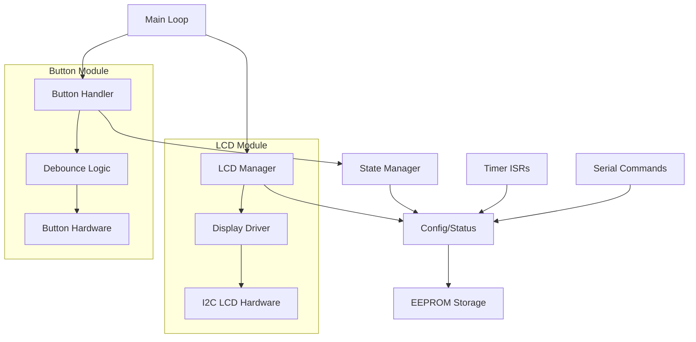
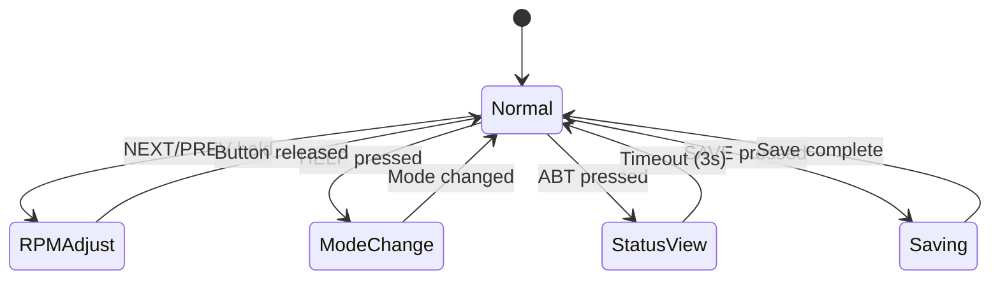

# Design Document

## Overview

This design adds an I2C LCD display interface with button controls to the existing Ardu-Stim ECU simulator. The implementation prioritizes memory efficiency, non-blocking operation, and modular design to support future hardware upgrades. The LCD interface operates independently of the core timing functions, ensuring pattern generation accuracy is maintained.

**Memory Constraints:**
- Current firmware: 22,494 bytes (68.6% of 30KB flash)
- Available flash: ~9.5KB for LCD functionality
- Target LCD module size: <4KB flash, <200 bytes RAM

## Architecture

### System Integration
The LCD interface integrates with the existing Ardu-Stim architecture through:
- **Non-intrusive Design**: LCD operations occur only in main loop, never in ISRs
- **Shared State Access**: Read-only access to existing global variables (config, currentStatus)
- **Event-driven Updates**: LCD refreshes triggered by state changes, not continuous polling
- **Modular Interface**: Abstract display layer for future TFT upgrade compatibility

### Component Interaction Diagram


## Components and Interfaces

### 1. Display Abstraction Layer

**Purpose**: Provide hardware-independent display interface for future TFT compatibility

**Interface:**
```cpp
class DisplayInterface {
public:
    virtual bool init() = 0;
    virtual void clear() = 0;
    virtual void setCursor(uint8_t col, uint8_t row) = 0;
    virtual void print(const char* text) = 0;
    virtual void print(int value) = 0;
    virtual bool isAvailable() = 0;
};

class LCDDisplay : public DisplayInterface {
private:
    LiquidCrystal_I2C* lcd;
    bool initialized;
public:
    // Implementation for 16x2 I2C LCD
};
```

**Memory Footprint**: ~800 bytes flash, ~20 bytes RAM

### 2. Button Input Manager

**Purpose**: Handle button debouncing, repeat actions, and state management

**Key Features:**
- Non-blocking debounce algorithm using millis()
- Configurable repeat rates for held buttons
- Priority handling for simultaneous button presses
- Interrupt-safe state tracking

**Interface:**
```cpp
struct ButtonState {
    bool pressed;
    bool held;
    uint32_t pressTime;
    uint32_t lastRepeat;
};

class ButtonManager {
private:
    ButtonState buttons[5];
    static const uint8_t BUTTON_PINS[5];
    static const uint32_t DEBOUNCE_TIME = 50;
    static const uint32_t REPEAT_DELAY = 500;
    static const uint32_t REPEAT_RATE = 150;
    
public:
    void init();
    void update();
    bool isPressed(uint8_t button);
    bool isHeld(uint8_t button);
    bool isRepeating(uint8_t button);
};
```

**Memory Footprint**: ~1200 bytes flash, ~40 bytes RAM

### 3. LCD Display Manager

**Purpose**: Coordinate display updates, manage screen states, and handle refresh logic

**Screen States:**
- **Main Display**: Wheel name, RPM, mode (text in Bahasa Indonesia, wheel names in original English)
- **Status Display**: Memory, uptime, version (triggered by ABT button, text in Bahasa Indonesia)
- **Message Display**: Temporary messages in Bahasa Indonesia (TERSIMPAN, ERROR, etc.)

**Interface:**
```cpp
enum DisplayMode {
    DISPLAY_MAIN,
    DISPLAY_STATUS,
    DISPLAY_MESSAGE
};

class LCDManager {
private:
    DisplayInterface* display;
    DisplayMode currentMode;
    uint32_t messageTimeout;
    bool needsRefresh;
    
    // Cached values for change detection
    uint8_t lastWheel;
    uint16_t lastRPM;
    uint8_t lastMode;
    
public:
    void init(DisplayInterface* disp);
    void update();
    void showMessage(const char* msg, uint16_t duration);
    void showStatus();
    void forceRefresh();
};
```

**Memory Footprint**: ~1500 bytes flash, ~60 bytes RAM

### 4. User Interface Controller

**Purpose**: Coordinate button actions with system state changes and display updates

**Button Mappings:**
- **PREV (D2)**: Previous wheel pattern / RPM decrease (when held)
- **NEXT (D3)**: Next wheel pattern / RPM increase (when held)  
- **SAVE (D4)**: Save configuration to EEPROM
- **ABT (D5)**: Show status information
- **HELP (D6)**: Cycle through RPM modes

**State Machine:**


**Interface:**
```cpp
class UIController {
private:
    ButtonManager* buttons;
    LCDManager* lcdManager;
    bool rpmAdjustMode;
    uint32_t statusTimeout;
    
public:
    void init(ButtonManager* btn, LCDManager* lcd);
    void update();
    void handleWheelSelection();
    void handleRPMAdjustment();
    void handleModeChange();
    void handleSave();
    void handleStatusView();
};
```

**Memory Footprint**: ~800 bytes flash, ~30 bytes RAM

## Data Models

### Configuration Extensions
No changes to existing `configTable` structure to maintain serial protocol compatibility.

### Display State Structure
```cpp
struct DisplayState {
    bool lcdAvailable;
    DisplayMode currentMode;
    uint32_t lastUpdate;
    uint32_t messageTimeout;
    char messageBuffer[17]; // 16 chars + null terminator
    bool forceRefresh;
};
```

### Button State Tracking
```cpp
struct ButtonConfig {
    static const uint8_t PREV_PIN = 2;
    static const uint8_t NEXT_PIN = 3;
    static const uint8_t SAVE_PIN = 4;
    static const uint8_t ABT_PIN = 5;
    static const uint8_t HELP_PIN = 6;
    
    static const uint8_t BUTTON_COUNT = 5;
    static const uint8_t BUTTON_PINS[BUTTON_COUNT];
};
```

## Error Handling

### LCD Initialization Failure
- System continues normal operation with serial interface only
- Error logged to serial output
- Periodic retry attempts (every 30 seconds)
- Status LED indication (if available)

### I2C Communication Errors
- Graceful degradation: skip display updates on I2C timeout
- Error counter with automatic recovery attempts
- Fallback to serial-only mode after persistent failures

### Button Hardware Issues
- Individual button failure detection
- Continued operation with remaining functional buttons
- Serial command fallback for failed button functions

### Memory Constraints
- Compile-time size validation
- Runtime memory monitoring (free RAM display in status screen)
- Graceful handling of low memory conditions

## Testing Strategy

### Unit Testing Approach
1. **Button Debouncing Tests**
   - Verify debounce timing accuracy
   - Test repeat rate functionality
   - Validate simultaneous button handling

2. **Display Update Tests**
   - Confirm refresh triggers on state changes
   - Validate message timeout behavior
   - Test screen transition logic

3. **Memory Usage Tests**
   - Compile-time size verification
   - Runtime memory leak detection
   - Stack usage analysis

### Integration Testing
1. **Non-interference Verification**
   - Pattern generation accuracy maintained
   - Timer interrupt timing unaffected
   - Serial communication preserved

2. **State Synchronization Tests**
   - LCD updates match actual system state
   - Button actions properly reflected
   - EEPROM save/load consistency

### Hardware Testing Protocol
1. **I2C Communication**
   - Address scanning and device detection
   - Communication reliability under load
   - Error recovery testing

2. **Button Response**
   - Debounce effectiveness
   - Repeat rate accuracy
   - Multi-button scenarios

3. **Memory Constraints**
   - Flash usage verification (target <4KB)
   - RAM usage monitoring
   - Performance impact measurement

### Performance Benchmarks
- LCD update frequency: <100ms for critical changes
- Button response time: <50ms after debounce
- Memory overhead: <4KB flash, <200 bytes RAM
- Pattern generation accuracy: No degradation from baseline

## Implementation Phases

### Phase 1: Core Infrastructure
- Display abstraction layer
- Basic I2C LCD driver integration
- Button debouncing framework

### Phase 2: Display Management
- Screen layout implementation
- State change detection
- Message display system

### Phase 3: User Interface
- Button action handlers
- RPM adjustment logic
- Mode switching functionality

### Phase 4: Integration & Testing
- System integration testing
- Memory optimization
- Error handling validation

This design ensures the LCD interface enhances the Ardu-Stim functionality without compromising its core timing precision, while providing a foundation for future hardware upgrades.